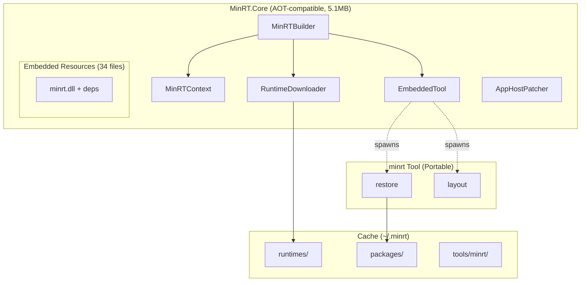
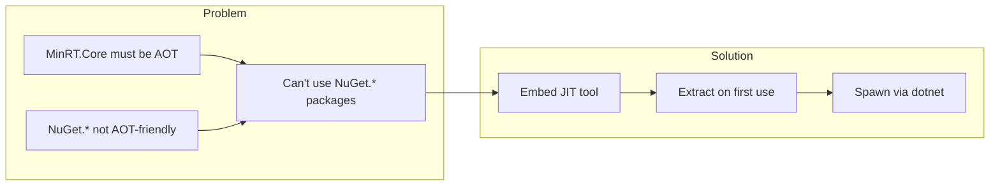
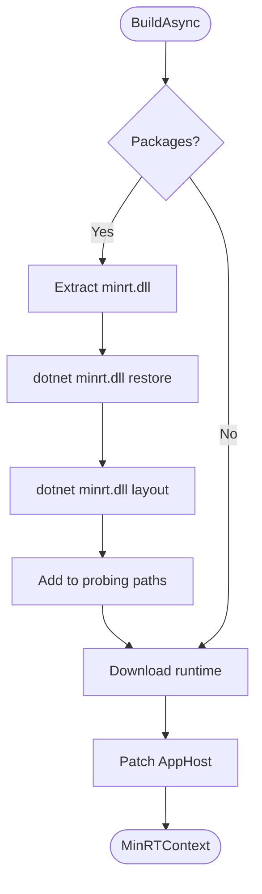

# MinRT - Implementation Plan

## Overview

MinRT is a minimal .NET runtime bootstrapper that downloads the runtime from NuGet and executes managed applications without requiring a pre-installed .NET SDK. It also provides NuGet package restore capabilities via an embedded tool.

## Status: ✅ All Parts Complete

| Part | Description | Status |
|------|-------------|--------|
| 1 | MinRT.Core - AOT bootstrapper | ✅ Complete |
| 2 | NuGet AssemblyLoadContext | ✅ Complete |
| 3 | minrt CLI tool | ✅ Complete |
| 4 | Embedded tool + unified API | ✅ Complete |

**Tests:** 35 passing | **CI:** All jobs green

---

## Architecture



## API

```csharp
// Basic: Download runtime and run app
var context = await new MinRTBuilder()
    .WithAppPath("myapp.dll")
    .WithRuntimeVersion("10.0.0")
    .BuildAsync();
context.Run();

// With ASP.NET Core
var context = await new MinRTBuilder()
    .WithAppPath("webapp.dll")
    .WithRuntimeVersion("10.0.0")
    .WithAspNetCore()
    .BuildAsync();

// With NuGet packages (auto restore + layout)
var context = await new MinRTBuilder()
    .WithAppPath("myapp.dll")
    .WithPackage("Newtonsoft.Json", "13.0.3")
    .WithPackage("Humanizer.Core", "2.14.1")
    .BuildAsync();
// context.PackageLayoutPath has the restored DLLs

// Offline with pre-built layout
var context = await new MinRTBuilder()
    .WithAppPath("myapp.dll")
    .WithLayout("./my-runtime")
    .RequireOffline()
    .BuildAsync();
```

## Cache Layout

```
~/.minrt/
├── runtimes/10.0.0-win-x64/     # Downloaded .NET runtime
│   ├── host/fxr/10.0.0/
│   └── shared/Microsoft.NETCore.App/10.0.0/
├── packages/                     # NuGet package cache + restore outputs
│   └── restore/{hash}/
│       ├── obj/project.assets.json
│       └── libs/*.dll
├── tools/minrt/                  # Extracted embedded tool
│   ├── minrt.dll
│   └── *.dll (dependencies)
└── apphosts/{hash}/              # Patched app executables
    ├── myapp.exe
    └── myapp.dll
```

---

## Part 4: Embedded NuGet Tool

### Why Embedded?



### Build Flow



### minrt Commands

```bash
# Restore packages to project.assets.json
minrt restore -p "Newtonsoft.Json 13.0.3" -o ./obj

# Create flat DLL layout
minrt layout -a ./obj/project.assets.json -o ./libs
```

### TestHost Usage

```bash
# Run app with automatic package restore
MinRT.TestHost myapp.dll --package Newtonsoft.Json 13.0.3
```

---

## Part 2: NuGet AssemblyLoadContext

Runtime NuGet package resolution via custom `AssemblyLoadContext`. For in-process package loading (alternative to embedded tool approach).

```csharp
var alc = await NuGetAssemblyLoader.CreateBuilder()
    .AddPackage("Newtonsoft.Json", "13.0.3")
    .AddPackage("Microsoft.Extensions.Logging", "9.0.0")
    .WithTargetFramework("net10.0")
    .UseDefaultNuGetConfig()
    .BuildAsync();

var assembly = alc.LoadAssembly("Newtonsoft.Json");
var type = alc.GetType("Newtonsoft.Json", "Newtonsoft.Json.JsonConvert");
```

---

## Project Structure

```
MinRT/
├── src/
│   ├── MinRT.Core/           # AOT bootstrapper (embeds minrt tool)
│   │   ├── MinRTBuilder.cs
│   │   ├── MinRTContext.cs
│   │   ├── EmbeddedTool.cs
│   │   ├── RuntimeDownloader.cs
│   │   └── AppHostPatcher.cs
│   │
│   └── MinRT.NuGet/          # NuGet library
│       ├── NuGetRestorer.cs
│       └── NuGetAssemblyLoader.cs
│
├── tools/minrt/              # CLI tool (embedded in Core)
│   └── Program.cs            # restore + layout commands
│
└── tests/
    ├── MinRT.Tests/          # 35 unit tests
    └── MinRT.TestHost/       # E2E test harness
```

## CI Jobs

| Job | Description |
|-----|-------------|
| build-linux/windows/macos | Publish minrt + TestHost |
| core-e2e-* | Run app without .NET installed |
| airgap-e2e-* | Offline mode with pre-built layout |
| nuget-tests | 35 unit tests |
| nuget-e2e | Full NuGet restore + run flow |
