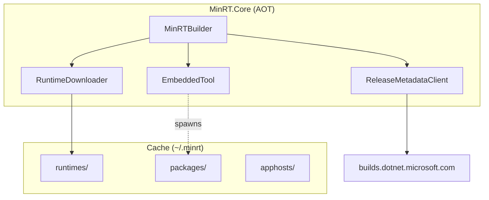

# MinRT - Specification

## Goal

Run .NET applications without requiring the .NET SDK or runtime to be pre-installed.

## Approach

1. **Download runtime from official archives** - Fetch from `builds.dotnet.microsoft.com` using release metadata API
2. **Use dotnet muxer** - Run apps via `dotnet myapp.dll` (no apphost patching needed)
3. **Set DOTNET_ROOT** - Configure the runtime location and spawn the process
4. **Cache everything** - Runtime and packages cached in `~/.minrt`

## Key Constraints

- **AOT-compatible** - MinRT.Core must compile to native code
- **No SDK dependency** - Works on machines with no .NET installed
- **Cross-platform** - Windows, Linux, macOS

## NuGet Package Support

Since NuGet libraries aren't AOT-friendly, MinRT embeds a portable `minrt` tool that runs via `dotnet` to handle package restore operations. This tool is extracted and spawned as a separate process when packages are requested.

## API

```csharp
// Download runtime and run app
var context = await new MinRTBuilder()
    .WithAppPath("myapp.dll")
    .WithRuntimeVersion("10.0.2")
    .BuildAsync();
context.Run();

// With NuGet packages
var context = await new MinRTBuilder()
    .WithAppPath("myapp.dll")
    .WithPackage("Newtonsoft.Json", "13.0.3")
    .BuildAsync();

// Offline with pre-built layout
var context = await new MinRTBuilder()
    .WithAppPath("myapp.dll")
    .WithLayout("./my-runtime")
    .RequireOffline()
    .BuildAsync();
```

## Architecture



## Runtime Download

MinRT uses the official .NET release metadata API:

```
https://builds.dotnet.microsoft.com/dotnet/release-metadata/
├── releases-index.json              # All major versions
└── {channel}/releases.json          # Download URLs + SHA512 hashes
```

The runtime ZIP includes the `dotnet` muxer, eliminating the need for apphost patching.

## Cache Layout

```
~/.minrt/
├── runtimes/{version}-{rid}/        # Downloaded .NET runtime
│   ├── dotnet.exe                   # Muxer
│   ├── host/fxr/{version}/
│   └── shared/Microsoft.NETCore.App/{version}/
├── packages/                         # NuGet restore outputs
│   └── restore/{hash}/
│       ├── obj/project.assets.json
│       └── libs/*.dll
└── apphosts/{hash}/                  # App copies
    ├── myapp.dll
    └── myapp.runtimeconfig.json
```

## Offline Layout

A layout is a self-contained directory with the runtime that can be distributed alongside the app. This enables air-gapped scenarios where no network access is available.

```csharp
// Create a layout (downloads runtime)
await new MinRTBuilder()
    .WithRuntimeVersion("10.0.2")
    .WithAspNetCore()
    .CreateLayoutAsync("./my-runtime");

// Use the layout offline
var context = await new MinRTBuilder()
    .WithAppPath("myapp.dll")
    .WithLayout("./my-runtime")
    .RequireOffline()
    .BuildAsync();
```

Layout structure:
```
my-runtime/
├── dotnet.exe                       # Muxer
├── host/fxr/{version}/hostfxr.dll
└── shared/
    ├── Microsoft.NETCore.App/{version}/
    └── Microsoft.AspNetCore.App/{version}/  # if WithAspNetCore()
```
