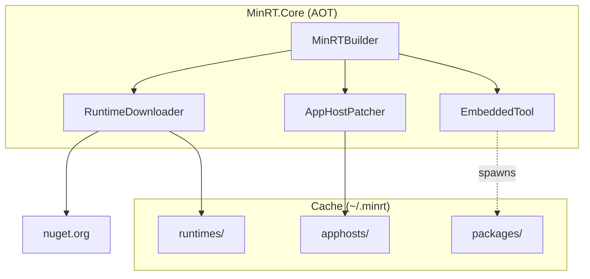

# MinRT - Specification

## Goal

Run .NET applications without requiring the .NET SDK or runtime to be pre-installed.

## Approach

1. **Download runtime from NuGet** - Fetch `Microsoft.NETCore.App.Runtime.{rid}` packages on-demand
2. **Patch AppHost** - Create a native executable that points to the app DLL
3. **Set DOTNET_ROOT** - Configure the runtime location and spawn the process
4. **Cache everything** - Runtime, packages, and patched executables cached in `~/.minrt`

## Key Constraints

- **AOT-compatible** - MinRT.Core must compile to native code
- **No SDK dependency** - Works on machines with no .NET installed
- **Cross-platform** - Windows, Linux, macOS

## NuGet Package Support

Since NuGet libraries aren't AOT-friendly, MinRT embeds a portable `minrt` tool that runs via `dotnet` to handle package restore operations. This tool is extracted and spawned as a separate process when packages are requested.

## API

```csharp
// Download runtime and run app
var context = await new MinRTBuilder()
    .WithAppPath("myapp.dll")
    .WithRuntimeVersion("10.0.0")
    .BuildAsync();
context.Run();

// With NuGet packages
var context = await new MinRTBuilder()
    .WithAppPath("myapp.dll")
    .WithPackage("Newtonsoft.Json", "13.0.3")
    .BuildAsync();

// Offline with pre-built layout
var context = await new MinRTBuilder()
    .WithAppPath("myapp.dll")
    .WithLayout("./my-runtime")
    .RequireOffline()
    .BuildAsync();
```

## Architecture


